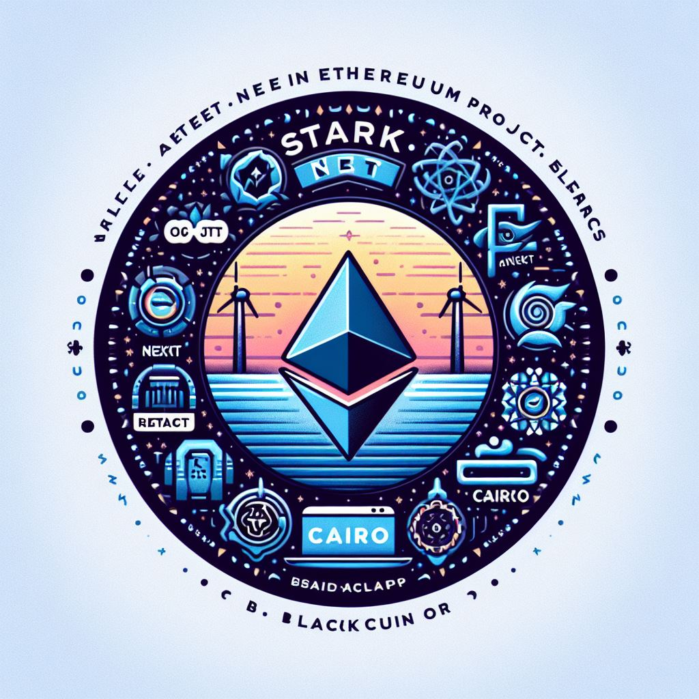

<div align="center">
# Mint My Moment: **Decentralized Moment Minting Platform**

Mint My Moment transforms memorable digital experiences into dynamic NFTs, which evolve and engage over time based on real-world interactions. These unique, tradeable assets can be personalized and are securely recorded on the blockchain. Owners and creators benefit from transparent transactions and potential royalties on various NFT marketplaces.

  
  <br />

</div>

## Getting Started

Install dependencies
```bash
npm install
# or
yarn
```


Run the development server:

```bash
npm run dev
# or
yarn dev
# or
pnpm dev
```

Open [http://localhost:3000](http://localhost:3000) with your browser to see the result.

You can start editing the page by modifying `app/page.tsx`. The page auto-updates as you edit the file.

This project uses [`next/font`](https://nextjs.org/docs/basic-features/font-optimization) to automatically optimize and load Inter, a custom Google Font.


## Contributors ✨

<!-- ALL-CONTRIBUTORS-LIST:START - Do not remove or modify this section -->
<!-- prettier-ignore-start -->
<!-- markdownlint-disable -->

<!-- markdownlint-restore -->
<!-- prettier-ignore-end -->

<!-- ALL-CONTRIBUTORS-LIST:END -->

This project follows the [all-contributors](https://github.com/all-contributors/all-contributors) specification. Contributions of any kind welcome!


